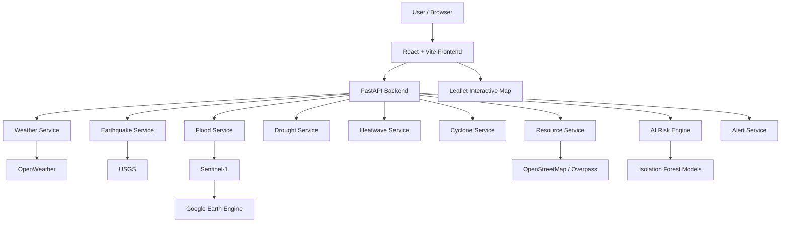

# CrisisCore — India Disaster Intelligence Map

> **AI-powered disaster monitoring, risk assessment, and emergency resource intelligence for India.**

CrisisCore 2.0 is an India-focused disaster intelligence platform designed to bring multiple disaster data sources into a single interactive system.

The platform combines **real-time and near-real-time disaster information, AI-based risk assessment, weather intelligence, geospatial visualization, and emergency resource discovery** into one unified dashboard.

The system is designed to help users understand:

- Where disasters are occurring
- What types of disasters are currently active
- How severe the overall risk is
- What the local weather conditions are
- Where hospitals and emergency shelters are located
- How disaster risk changes according to geographic location
- How multiple disaster data sources can be combined into one intelligence layer

---

## 🌍 Project Overview

India is highly exposed to multiple natural hazards including:

- 🌊 Floods        - 🌍 Earthquakes         - 🌵 Droughts         - 🔥 Heatwaves          - 🌀 Cyclones

Disaster information is often distributed across different systems, agencies, datasets, and geographical services.
CrisisCore attempts to solve this fragmentation by providing a centralized **India Disaster Intelligence Map**.
The platform collects disaster-related information from multiple sources, processes the information through backend services and AI-based risk analysis, and presents the results through an interactive web dashboard.

### Core Concept

```text
External Data Sources
        ↓
Data Collection & Processing
        ↓
Disaster Detection / Analysis
        ↓
AI Risk Assessment
        ↓
FastAPI Backend
        ↓
React + Leaflet Frontend
        ↓
Interactive India Disaster Intelligence Dashboard
```

---

# ✨ Key Features

## 🗺️ 1. India-Wide Disaster Intelligence Map

The central feature of CrisisCore 2.0 is an interactive map covering India.

The map provides geographic visualization of disaster-related information and emergency resources.

### Supported map layers

- 🌊 Flood
- 🌍 Earthquake
- 🌵 Drought
- 🔥 Heatwave
- 🌀 Cyclone
- 🏥 Hospitals
- 🏠 Shelters

The map is implemented using **Leaflet** through **React Leaflet**.

---

# 🌊 2. Flood Monitoring

CrisisCore includes a satellite-based flood monitoring module designed around:

- Sentinel-1 satellite data
- Google Earth Engine
- Geospatial processing

The flood service is designed to use the latest available Sentinel-1 satellite data.

### Google Earth Engine

The flood-processing pipeline requires Google Earth Engine authentication.

If Earth Engine has not been authenticated, the application safely reports the flood service as unavailable rather than pretending that flood data exists.

---

# 🌍 3. Earthquake Monitoring

CrisisCore integrates earthquake information from the **USGS**.

The earthquake service provides India-relevant earthquake events and exposes them through the backend.

Earthquake events are displayed on the interactive map using geographic markers whose visual size can represent magnitude.

---

# 🌵 4. Drought Monitoring

The platform includes a drought analysis layer based on weather-related information.

Drought information is processed through the backend disaster services and incorporated into the overall disaster intelligence system.

Drought conditions can contribute to the AI-based risk assessment.

---

# 🔥 5. Heatwave Monitoring

CrisisCore includes a heatwave monitoring service based on weather information.

The system analyzes local weather conditions and identifies areas experiencing potentially elevated heat-related conditions.

Heatwave information contributes to:

- Disaster visualization
- Risk analysis
- Overall risk calculation

---

# 🌀 6. Cyclone Monitoring

The platform includes cyclone monitoring capabilities for Indian regions.

Cyclone information can be visualized geographically and incorporated into the overall disaster risk engine.

The system is designed to support:

- Cyclone location information
- Severity information
- Geographic visualization
- Risk contribution

---

# 🤖 7. AI-Powered Risk Assessment

One of the core components of CrisisCore 2.0 is its AI-based disaster risk engine.

The system combines information from multiple disaster types and analyzes the available information to produce an overall risk assessment.

The AI layer includes anomaly-detection models for:

- 🌊 Flood
- 🌍 Earthquake
- 🔥 Heatwave
- 🌵 Drought
- 🌀 Cyclone

The current implementation uses **Isolation Forest-based models** for anomaly detection.

---

# ⚠️ 8. Overall Risk Dashboard

The frontend provides an overall risk card that summarizes the current disaster risk.

Possible risk levels include:

- 🟢 LOW
- 🟡 MEDIUM
- 🟠 HIGH
- 🔴 CRITICAL
- ⚪ UNAVAILABLE

---

# 🌦️ 9. Location-Based Weather Intelligence

CrisisCore integrates weather information using **OpenWeather**.

---

# 📍 10. Automatic User Location Detection

When supported by the browser, CrisisCore attempts to determine the user's geographic location using browser geolocation.

The detected coordinates are used for location-specific services such as:

- Weather
- AI risk assessment
- Nearest hospitals
- Nearest shelters
- 
---

# 🏥 11. Emergency Hospital Discovery

CrisisCore provides hospital information using **OpenStreetMap-based geographic data**.

The nearest hospital can also be surfaced through the dashboard's resource information.

---

# 🏠 12. Emergency Shelter Discovery

The platform also provides emergency shelter information using OpenStreetMap geographic data.

Shelter-related resources are identified using OpenStreetMap tags such as:

- Social facilities
- Community centres
- Shelter-related facilities
- Relief-related facilities
- Refuge-related facilities
- Emergency-related facilities

---

# 🚨 13. Disaster Alerts

The backend generates disaster alerts based on detected disaster information.

The frontend can filter alerts according to severity.

---

# 🧠 14. Multi-Source Disaster Intelligence

CrisisCore does not depend on a single data provider.

The current system combines information from multiple sources:

| Data | Source |
|---|---|
| Flood monitoring | Sentinel-1 / Google Earth Engine |
| Earthquakes | USGS |
| Weather | OpenWeather |
| Drought analysis | OpenWeather |
| Heatwave analysis | OpenWeather |
| Cyclone analysis | OpenWeather |
| Hospitals | OpenStreetMap |
| Shelters | OpenStreetMap |
| Geographic visualization | Leaflet / OpenStreetMap |

This multi-source approach allows the platform to combine different forms of environmental and geographic intelligence.

---

# 🏗️ System Architecture



---

# 🔄 Application Data Flow

```text
                    ┌─────────────────────┐
                    │   External Sources  │
                    └──────────┬──────────┘
                               │
             ┌─────────────────┼─────────────────┐
             │                 │                 │
             ▼                 ▼                 ▼
        OpenWeather          USGS         Sentinel-1/GEE
             │                 │                 │
             └─────────────────┼─────────────────┘
                               │
                               ▼
                    ┌─────────────────────┐
                    │   FastAPI Backend   │
                    └──────────┬──────────┘
                               │
            ┌──────────────────┼──────────────────┐
            │                  │                  │
            ▼                  ▼                  ▼
      Disaster Services   Resource Service   AI Risk Engine
            │                  │                  │
            └──────────────────┼──────────────────┘
                               │
                               ▼
                    ┌─────────────────────┐
                    │     REST APIs       │
                    └──────────┬──────────┘
                               │
                               ▼
                    ┌─────────────────────┐
                    │ React/Vite Frontend │
                    └──────────┬──────────┘
                               │
              ┌────────────────┼────────────────┐
              │                │                │
              ▼                ▼                ▼
          Dashboard       Risk Cards       Leaflet Map
```

---

# 🛠️ Technology Stack

## Frontend

- React
- Vite
- JavaScript
- React Leaflet
- Leaflet
- CSS
- Browser Geolocation API

## Backend

- Python
- FastAPI
- Uvicorn
- Pydantic
- REST APIs

## Artificial Intelligence / Machine Learning

- Scikit-learn
- Isolation Forest
- NumPy
- SciPy
- Joblib

## Geospatial / Remote Sensing

- Google Earth Engine
- Sentinel-1
- Rasterio
- GeoPandas
- Folium
- Geemap
- Shapely
- PyProj

## External Data Sources

- USGS
- OpenWeather
- OpenStreetMap
- Overpass API
- Sentinel-1
- Google Earth Engine

## Mapping

- Leaflet
- React Leaflet
- OpenStreetMap tiles

---

# 🚀 Getting Started

## Prerequisites

Make sure the following are installed:

- Python 3.12+
- Node.js
- npm
- Git

For the satellite flood-processing functionality, a Google Earth Engine account and authentication are also required.

---

# 📥 Clone the Repository

```bash
git clone <YOUR_GITHUB_REPOSITORY_URL>
cd crisiscore-disaster-preparedness-2.0
```

---

# 🖥️ Frontend Setup

Open a terminal in the project root.

```bash
cd frontend
```

Install dependencies:

```bash
npm install
```

Start the Vite development server:

```bash
npm run dev
```

The frontend will normally be available at:

```text
http://localhost:5173
```

---

# 🐍 Backend Setup

Open another terminal.

```bash
cd backend
```

Create a Python virtual environment.

### Windows

```powershell
py -m venv venv
```

Activate it:

```powershell
.\venv\Scripts\Activate.ps1
```

Install backend dependencies:

```powershell
python -m pip install --upgrade pip
python -m pip install -r requirements.txt
```

Start the FastAPI server:

```powershell
python -m uvicorn main:app --reload --port 8000
```

The backend will normally be available at:

```text
http://127.0.0.1:8000
```

FastAPI's interactive API documentation is available at:

```text
http://127.0.0.1:8000/docs
```

---

# 🔐 Google Earth Engine Setup

The flood detection service uses Google Earth Engine.

Authenticate your Earth Engine account from the backend environment:

```bash
earthengine authenticate
```

After authentication, restart the backend.

You can check flood-service availability through:

```text
GET /api/flood-status
```

The general health endpoint also reports whether the flood service is ready.

```text
GET /health
```

---

# 🔑 API Configuration

Some external services require API credentials.

Before running the application, configure the required credentials according to the project's backend configuration.

Typical external services include:

- OpenWeather
- Google Earth Engine

Never commit private API keys, service-account credentials, or other secrets to GitHub.

Use environment variables or the project's configuration mechanism for local credentials.

---

# 🧭 Map Interaction

The map starts with an India-wide view.

Approximate India map bounds are configured so that the primary map remains focused on India.

Users can:

1. Zoom into a region.
2. Pan across the country.
3. Enable or disable disaster layers.
4. Enable hospital and shelter layers.
5. Inspect individual markers.
6. Select geographic locations.
7. Run map-based flood analysis where the flood service is available.

---

# 📊 Dashboard Components

The frontend dashboard is organized into several major components.

### Risk Cards

Displays important high-level information such as:

- Weather
- Overall risk
- Alerts

### Risk Analysis

Provides additional information about disaster risk.

### Alert Panel

Displays important disaster alerts.

### Resource Cards

Displays emergency resource information such as:

- Nearest hospital
- Nearest shelter

### Disaster Map

Provides the primary geospatial visualization and layer controls.

---

# 🧩 Frontend Architecture

```text
App.jsx
   │
   ├── RiskCards
   │
   ├── RiskAnalysis
   │
   ├── AlertPanel
   │
   ├── ResourceCard
   │
   └── DisasterMap
           │
           ├── Leaflet
           ├── Disaster Layers
           ├── Hospital Layer
           ├── Shelter Layer
           ├── User Location
           ├── Flood Analysis
           └── Map Viewport Resource Loading
```

The frontend communicates with the FastAPI backend through a centralized API service.

---

# 🧠 Backend Architecture

```text
main.py
 │
 ├── Weather Service
 │
 ├── Flood Service
 │      └── Sentinel-1 / Google Earth Engine
 │
 ├── Earthquake Service
 │      └── USGS
 │
 ├── Drought Service
 │      └── Weather Data
 │
 ├── Heatwave Service
 │      └── Weather Data
 │
 ├── Cyclone Service
 │      └── Weather Data
 │
 ├── Resource Service
 │      └── OpenStreetMap / Overpass
 │
 ├── Alert Service
 │
 ├── Traditional Risk Engine
 │
 └── AI Risk Engine
        ├── Flood Model
        ├── Earthquake Model
        ├── Heatwave Model
        ├── Drought Model
        └── Cyclone Model
```

---

# 🔬 AI / Machine Learning Pipeline

The AI risk engine uses anomaly detection models to identify unusual or potentially hazardous conditions.

The current model architecture includes separate models for different disaster types.

```text
                    Input Features
                         │
          ┌──────────────┼──────────────┐
          │              │              │
       Weather        Disaster       Geographic
        Data            Data           Context
          │              │              │
          └──────────────┼──────────────┘
                         ↓
                 Feature Extraction
                         ↓
                  Isolation Forest
                         ↓
                  Anomaly Detection
                         ↓
                   Risk Evaluation
                         ↓
                   Overall Risk
```

The system loads trained model artifacts through the backend's AI risk engine.

---

# 📡 Data Sources

## Sentinel-1

Used as the satellite data source for flood monitoring.

The flood service is designed around satellite-based analysis of geographic regions.

## Google Earth Engine

Used to access and process satellite-based geospatial information for the flood module.

## USGS

Used for earthquake event information.

## OpenWeather

Used for location-specific weather and weather-derived disaster analysis.

## OpenStreetMap

Used for geographic resource information including hospitals and shelters.

## Overpass API

Used to query OpenStreetMap geographic objects within specified geographic areas.

---

# 🗺️ Example User Flow

```text
User opens CrisisCore
        ↓
Browser requests location
        ↓
Location detected
        ↓
Weather loaded
        ↓
Nearby disaster information loaded
        ↓
AI risk calculated
        ↓
Nearby hospitals and shelters loaded
        ↓
India disaster map displayed
        ↓
User zooms/pans the map
        ↓
Map viewport changes
        ↓
Hospitals and shelters for visible area requested
        ↓
Resource markers updated
```

---


The assistant can use the existing disaster intelligence context instead of relying only on general-purpose responses.

---

# 📈 Scalability Considerations

CrisisCore is designed with a modular backend architecture.

Each disaster type is implemented as a separate service.

This allows additional data sources and disaster types to be added without completely rewriting the application.

The architecture can be extended to support:

```text
New Data Source
      ↓
New Service
      ↓
Risk Engine
      ↓
API Endpoint
      ↓
Frontend Layer
```
---

# 💡 Why CrisisCore ?

Traditional disaster information systems may require users to consult multiple sources to understand a developing situation.

CrisisCore attempts to simplify this process by providing a unified interface.

Instead of separately checking:

```text
Weather
+
Earthquakes
+
Flood information
+
Cyclones
+
Drought
+
Heatwaves
+
Hospitals
+
Shelters
```

the platform brings them together:

```text
              CRISISCORE 2.0
                    │
       ┌────────────┼────────────┐
       │            │            │
    DISASTERS      RISK       RESOURCES
       │            │            │
       ▼            ▼            ▼
   Multi-hazard   AI-based   Hospitals
      Map          Risk       Shelters
       │            │            │
       └────────────┼────────────┘
                    ▼
             Unified Intelligence
```

---


# 📚 Project Documentation

Important areas of the project include:

```text
frontend/
    React user interface
    Leaflet map
    Dashboard components
    API integration

backend/
    FastAPI application
    Disaster services
    AI risk engine
    Weather integration
    Resource discovery
    Flood monitoring
```

The FastAPI Swagger interface provides an interactive way to inspect and test backend endpoints during development.

---

# CrisisCore 

### India Disaster Intelligence Map

**Detect. Analyze. Predict. Respond.**
